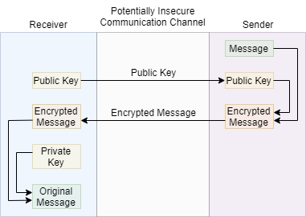

# RSA Encryption

RSA (Rivest–Shamir–Adleman) is a public-key cryptosystem that is widely used for secure data transmission. It is also one of the oldest. The acronym "RSA" comes from the surnames of Ron Rivest, Adi Shamir and Leonard Adleman, who publicly described the algorithm in 1977.

## The math behind RSA Encryption

$$
n = p \times q,\quad p\text{ and }q\text{ is prime} 
$$

Calulate the totinet of $n$
$$
r = \varphi(x) = (p-1)(q-1)
$$

Select a $e$, which is coprime of $n$:
$$
gcd(e, \varphi(n)) = 1 \\
1<e<\varphi(n)
$$

Then, you create the public key $(n,e)$

Then, making private key variable $d$, which has the following property:
$$
(d \times e) \text{mod } r = 1
$$

The $(n, d)$ is private key.

Then the encryption and decryption:
$$
Encrypter(\text{message}, \text{public key}) = \text{message}^e \text{mod } n \\ \text{public key} = (n, e)
$$

$$
Decrypter(\text{Encrypted Message}, \text{private key}) = \text{Encrypted Message}^d \text{mod } n
\\ \text{privete key} = (n, d)
$$

The way to brute force this encryption is to find $p$ and $q$. And then you can find $r$, with $r$ and $e$ you can calulate private key $d$. So, the more difficult to break down $n$ to $p$ and $q$, the more safer the RSA encryption is.

## Reference
[https://medium.com/@jinkyulim96/algorithms-explained-rsa-encryption-9a37083aaa62](https://medium.com/@jinkyulim96/algorithms-explained-rsa-encryption-9a37083aaa62)

[https://www.bilibili.com/video/BV1h5411m78h?spm_id_from=333.337.search-card.all.click](https://www.bilibili.com/video/BV1h5411m78h?spm_id_from=333.337.search-card.all.click)