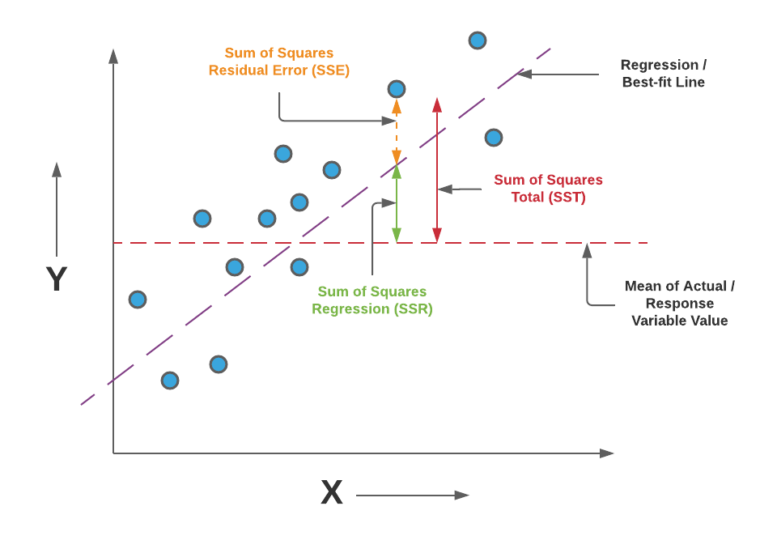

# Linear Regression

$$
y_i=\beta_0+\beta_1x_{i1}+\beta_2x{i2}+...+\beta_px_{ip}+\epsilon_i,\ \ \ \ i=1,...,n
$$

Written in matrix notation:

$$
y = X\beta+\epsilon
$$

where:

$$
y=\begin{pmatrix}
y_1 \\
y_2 \\
\vdots \\
y_n
\end{pmatrix},
$$

$$
X=\begin{pmatrix}
x_1^T \\
x_2^T \\
\vdots \\
x_n^T \\
\end{pmatrix}=\begin{pmatrix}
1 & x_{11} & \cdots & x_{1p} \\
1 & x_{21} & \cdots & x_{2p} \\
\vdots & \vdots & \ddots & \vdots \\ 
1 & x_{n1} & \cdots & x_{np}
\end{pmatrix},
$$

$$
\beta = \begin{pmatrix}
\beta_0 \\
\beta_1 \\
\beta_2 \\
\vdots \\
\beta_p 
\end{pmatrix},
\epsilon=\begin{pmatrix}
\epsilon_1 \\
\epsilon_2 \\
\vdots \\
\epsilon_n
\end{pmatrix}.
$$

So how can we estimate $\beta$, we can use Least-squares estimation.

## Least-squares estimation

Assuming the independent variable is $\overrightarrow{x_i}=[1, x_1^i,x_2^i,\cdots,x_m^i]$ and model's parameters are $\overrightarrow{\beta}=[\beta_0,\beta_1,\cdots,\beta_m]$, then the model's prediction would be

$$
y_i \approx \sum_{j=0}^m \beta_j \times x_j^i = \overrightarrow{\beta} \cdot \overrightarrow{x_i}
$$

In the least-squares setting, the optimum parameter is defined as such that minimizes the sum of **mean squared loss**:

$$
\overrightarrow{\hat{\beta}} = \text{arg}_{\overrightarrow{\beta}} \text{min} L(D,\overrightarrow{\beta}) = \text{arg}_{\overrightarrow{\beta}} \text{min}\sum_{i=1}^n(\overrightarrow{\beta} \cdot \overrightarrow{x_i}-y_i)^2
$$

We use sum of squard to estimate the result are 2 reasons:
* Regradless of the deviation between $y$ and $\hat{y}$, use $(y-\hat{y})^2$ is will be positive, and it will punish more if you are too far away from the line.

## **Loss function**

$$
\begin{equation}
\begin{split}
L(D,\overrightarrow{\beta}) & = 
||X\overrightarrow{\beta}-Y||^2 \\
& = (X\overrightarrow{\beta}-Y)^T (X\overrightarrow{\beta}-Y) \\
& = Y^T Y - Y^T X \overrightarrow{\beta} - \overrightarrow{\beta} X^T Y+ \overrightarrow{\beta}^T X^T X \overrightarrow{\beta}
\end{split}
\end{equation}
$$

$$
\frac{\partial L(D,\overrightarrow{\beta})}{\partial \overrightarrow{\beta}} = \frac{\partial (Y^T Y - Y^T X \overrightarrow{\beta} - \overrightarrow{\beta} X^T Y+ \overrightarrow{\beta}^T X^T X \overrightarrow{\beta})}{\partial \overrightarrow{\beta}} = -2X^TY + 2X^TX\overrightarrow{\beta}
$$

Setting the gradient to zero produces the optimum parameter:

$$
\begin{align}
-2X^TY+2X^TX\overrightarrow{\beta} & = 0 \\
\implies X^TY & = X^TX\overrightarrow{\beta} \\ 
\implies \overrightarrow{\hat{\beta}} & = (X^TX)^{-1}X^TY
\end{align}
$$

To prove that the $\hat{\beta}$ obtained is indeed the local minimum, one needs to **differentiate once more to obtain the Hessian matrix** and show that it is positive definite. This is provided by the **Gauss–Markov theorem**.

## Analysis of variance (ANOVA)

https://web.njit.edu/~wguo/Math644_2012/Math644_Chapter%201_part4.pdf
### Deviation
$\underbrace{Y_i-\bar{Y}}_{\text{Total deviation}} = \underbrace{\hat{Y_i}-\bar{Y}}_{\text{Deviation due the regression}}+\underbrace{e_i}_{\text{Deviation due the error}}\\$
We can sum them squard up:
$\underbrace{\sum_{i=1}^n (Y_i-\bar{Y})^2}_{\text{SST}} = \underbrace{{\sum_{i=1}^n}(\hat{Y_i}-\bar{Y})^2}_{\text{SSR}} + \underbrace{\sum_{i=1}^n e_i^2}_{\text{SSE}}$
SST: Total Sum of squares 
SSR: Sum squares due to regression
SSE: Sum of squares of error/residuals

And look at this picture:

You can see:
$SST=SSR+SSE$

## Degrees of freedom
The degree of freedom of SST is n-1: noticing that
$$Y_1-\bar{Y},...,Y_{n}-\bar{Y}$$
have one constraint $\sum_{i=1}^n(Y_i - \bar{Y})=0$

The degree of freedom for SSR is 1
Because:
$$\hat{Y_i} = b_0+b_1X_i$$
The degree of freedom for SSE is n-2, noticing that:
$$e_1,e_2,e_3...,e_n$$
it has TWO constraints: $$
