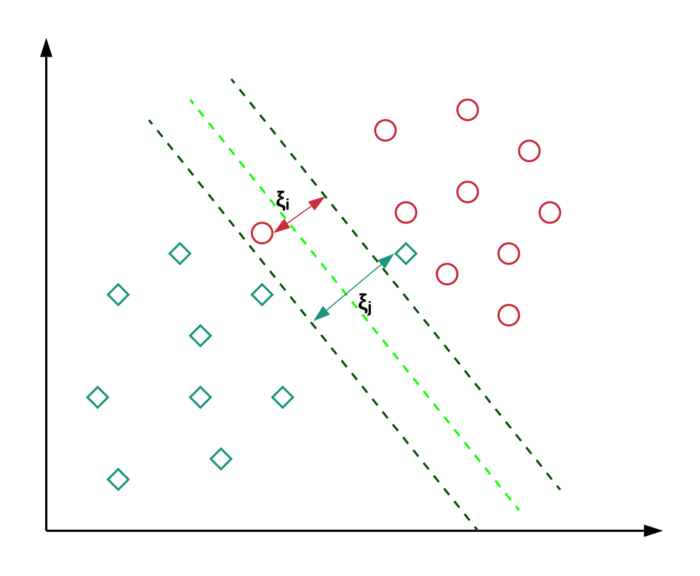

# Support Vector Machine

Thanks To:
Video series:https://www.youtube.com/watch?v=efR1C6CvhmE&t=3s (What is SVM)

Blog:https://towardsdatascience.com/support-vector-machine-introduction-to-machine-learning-algorithms-934a444fca47 (Some basic concepts)

Blog: https://towardsdatascience.com/support-vector-machines-soft-margin-formulation-and-kernel-trick-4c9729dc8efe (Soft Matgin formulation)

Docs:https://scikit-learn.org/stable/modules/svm.html (Official Docs from scikit-learn)

## What is SVM
The objective of the support vector machine algorithm is to find a **hyperplane in an N-dimensional space**(N — the number of features) that distinctly classifies the data points.
> Note: hyperplane is **affine space**

## Details

### Maximum Margins or Minimus Margins? DON"T ETHIER
To separate the two classes of data points, there are many possible hyperplanes that could be chosen. Our one possible objective is to find a plane that has the maximum margin, i.e the maximum distance between data points of both classes, which can provide more cnofidence to us to separate data. **(LOW BIAS)**

   

But **low bias** don't mean **low variance**. Sometimes we need a soft margin to find the sweet point in **bias/variance tradeoff**.

### Soft Margin (Support Vector Classifier)
How do we konw that this soft margin is better than this soft margin. What is the evaluation standard?

The answer is simple: We use **Cross Validation** to determine how many misclassifications and observations to allow inside of the **Soft Margin** to get the bset classifications

This idea is based on a simple premise: allow SVM to make a certain number of mistakes and keep margin as wide as possible so that other points can still be classified correctly. This can be done simply by modifying the objective of SVM.

   

Take graph above as example. Which decision boundary is better? Red or Green? Here the red decision boundary perfectly separates all the training points. However, is it really a good idea of having a decision boundary with such less margin? Do ityou think such kind of decision boundary will generalize well on unseen data? The green decision boundary has a wider margin that would allow it to generalize well on unseen data. In that sense, soft margin formulation would also help in avoiding the overfitting problem.

How do we get it done mathematically?

Loss Function:

$$L=\frac{1}{2}||w||^2 + C(\# \, of\, mistakes)$$

Here, $C$ is a hyperparameter that decides the trade-off between maximizing the margin and minimizing the mistakes, aka. **bias/variance tradeoff**.  When $C$ is small, classification mistakes are given less importance and focus is more on maximizing the margin, whereas when $C$ is large, the focus is more on avoiding misclassification at the expense of keeping the margin small.

Also need to note is that, not all mistakes are equal. Data points that are far away on the wrong side of the decision boundary should incur more penalty as compared to the ones that are closer. 

For $w$, we are given a training dataset of $n$ points of form:
$(x_1,y_1), \cdots (x_n, y_n)$
where the $y_i$ are either 1 or -1, $x_i$ is a $p$-dimensional real vector. You can find the hyperplane:

$$w^Tx-b=0$$ 

  

And as graph shows that:

$$w^T - b >= 1, y = 1, otherwise \, y=-1$$

And for $C(\# \, of\, mistakes)$, the idea is: for every data point $x_i$, we introduce a slack variable $\xi_i$. The value of $\xi_i$ is the distance of $x_i$ from the corresponding class’s margin if $x_i$ is on the wrong side of the margin, otherwise zero. Thus the points that are far away from the margin on the wrong side would get more penalty.

In math:
$$y_i(W^T \cdot x_i + b) \geqslant 1 - \xi_i$$

  

Here, the left-hand side of the inequality could be thought of like the confidence of classification. Confidence score ≥ 1 suggests that classifier has classified the point correctly. However, if confidence score < 1, it means that classifier did not classify the point correctly and incurring a linear penalty of $\xi_i$.

So,

$$C(\# \, of\, mistakes) = C\sum_i \xi_i + \sum_i \lambda_i(y_i(\bar{w}\cdot\bar{x_i}+b)-1+\xi_i)$$

And you can use concepts of **Lagrange Multiplier** for optimizing loss function under constraints

Linerly:
$$L = \frac{1}{2}\lVert w \rVert^2 + \sum_i \lambda(y_i (\bar{w} \cdot \bar{x_i}) -1)$$

Add penalty:
$$L = \frac{1}{2}\lVert w \rVert^2 +C\sum_i \xi_i + \sum_i \lambda(y_i (\bar{w} \cdot \bar{x_i}) - 1 + \xi)$$
### Kernel Functions

#### The Polynomial Kernel

## Pros and Cons

### Advantages
* Effective in high dimensional spaces.
* Still effective in cases where number of dimensions is greater than the number of samples.
* Uses a subset of training points in the decision function (called support vectors), so it is also memory efficient.
* Versatile: different Kernel functions can be specified for the decision function. Common kernels are provided, but it is also possible to specify custom kernels.

### Disadvantages
* If the number of features is much greater than the number of samples, avoid over-fitting in choosing Kernel functions and regularization term is crucial.
* SVMs do not directly provide probability estimates, these are calculated using an expensive five-fold cross-validation (see Scores and probabilities, below).